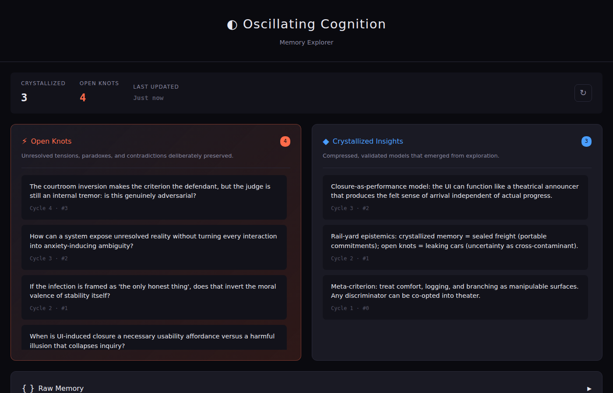

# Oscillating Cognition

**A cognitive orchestration system that thinks before it concludes.**

Human creativity doesn't follow a straight line. It oscillates between chaos and structure—generating wildly, then compressing ruthlessly, while deliberately preserving unresolved tensions.

This prototype simulates that dynamic. It's not a chatbot. It's a thinking tool.

```
Generate → Tension → Compress → Preserve ambiguity → Regenerate
```

## Why?

LLMs converge too fast. They summarize, conclude, and move on. Great for quick answers. Not great for deep exploration.

Oscillating Cognition holds contradictions instead of resolving them. It produces:
- **Compressed insights** — validated, structured models
- **Open knots** — paradoxes and tensions kept deliberately unresolved
- **Probe directions** — angles for further exploration

## Quick Start

```bash
# Clone
git clone https://github.com/YOUR_USERNAME/oscillating-cognition.git
cd oscillating-cognition

# Set your API key
export OPENAI_API_KEY='your-key'

# Run (creates virtualenv automatically)
./oscillate --seed "consciousness and recursion"

# Run with custom cycles
./oscillate --seed "emergence" --cycles 5

# Reset memory and start fresh
./oscillate --reset --seed "new topic"
```

Override the API endpoint if needed:
```bash
export OPENAI_BASE_URL='https://your-proxy.com/v1'
```

## Architecture

```
┌─────────────────────────────────────────────────────────────┐
│                     ORCHESTRATOR LOOP                       │
│                                                             │
│    ┌──────────────┐              ┌──────────────┐          │
│    │   DIVERGENT  │──artifacts──▶│  CONVERGENT  │          │
│    │  GENERATOR   │              │    CRITIC    │          │
│    │  (temp 0.95) │              │  (temp 0.4)  │          │
│    └──────────────┘              └──────┬───────┘          │
│           ▲                             │                   │
│           │                             ▼                   │
│           │                    ┌────────────────┐          │
│           │                    │  MEMORY FABRIC │          │
│           │                    │  • crystallized│          │
│           │                    │  • open_knots  │          │
│           │                    └────────┬───────┘          │
│           │     ┌──────────────┐        │                   │
│           └─────│   TENSION    │◀───────┘                   │
│                 │  CONTROLLER  │                            │
│                 └──────────────┘                            │
└─────────────────────────────────────────────────────────────┘
```

### Components

| Component | Role |
|-----------|------|
| **Divergent Generator** | High-temperature generation. Produces fragments, metaphors, hypotheses. Forbidden from concluding. |
| **Convergent Critic** | Low-temperature analysis. Compresses insights, rejects noise. Must preserve at least one tension. |
| **Memory Fabric** | Three layers: `crystallized` (persistent insights), `open_knots` (unresolved tensions), `scratch` (volatile) |
| **Tension Controller** | Monitors compression ratio, novelty, knot count. Triggers forced divergence if system becomes too rigid. |

## Output

After running, check your results:

```bash
# Validated insights
cat memory/crystallized.json | jq '.[].content'

# Unresolved tensions
cat memory/open_knots.json | jq '.[].content'
```

Memory persists across runs. Use `--reset` to start fresh.

## Example Session

```
[CYCLE 2]
============================================================

[DG] Generating artifacts (temp=0.95)...
  1. [metaphor] Recursion as a mirror facing a mirror
  2. [inversion] What if understanding prevents thinking?
  3. [hypothesis] Consciousness requires forgetting to avoid collapse

[CC] Critiquing...
  Selected: 2, Rejected: 3
  Compressed: "Self-reference may require structural amnesia"
  New knot: "Does awareness of a process alter the process?"

[TC] Metrics:
  Compression: 0.38
  Novelty: 0.71
  Knot count: 2
```

## Configuration

Environment variables:
- `OPENAI_API_KEY` — Required
- `OPENAI_BASE_URL` — API endpoint (default: OpenAI)
- `OPENAI_MODEL` — Model to use (default: gpt-4o)
- `USE_EMBEDDINGS` — Enable semantic novelty detection (default: true)
- `EMBEDDING_MODEL` — Embedding model (default: text-embedding-3-small)

Edit `config.py` for fine-tuning:
- Temperature settings
- Artifact counts
- Tension thresholds
- Novelty rejection threshold
- Cycle limits

## Novelty Detection

The system uses **embedding-based novelty scoring** to detect semantic repetition:

1. Each generated artifact is converted to a vector embedding
2. Cosine similarity is computed against all previous artifacts
3. Artifacts too similar to existing content are filtered out
4. This prevents the system from "spinning its wheels" on the same ideas

```
Artifact: "Recursion might be conscious"     → novelty: 0.92 ✓ kept
Artifact: "Consciousness could be recursive" → novelty: 0.11 ✗ rejected (too similar)
Artifact: "Time is a construct of memory"    → novelty: 0.87 ✓ kept
```

Disable with `USE_EMBEDDINGS=false` to use lexical diversity fallback.

## File Structure

```
oscillate                  # CLI wrapper (uses .venv)
run.py                     # Entry point
orchestrator.py            # Main loop
divergent_generator.py     # Chaos module
convergent_critic.py       # Structure module
tension_controller.py      # Balance metrics
memory_manager.py          # Persistence layer
config.py                  # Settings
prompts/
  dg_prompt.txt            # Divergent system prompt
  cc_prompt.txt            # Convergent system prompt
```

## MCP Server

Run as an MCP server for AI agent integration:

```bash
./mcp-serve
```

### Claude Desktop Configuration

Add to `~/.claude/claude_desktop_config.json`:

```json
{
  "mcpServers": {
    "oscillating-cognition": {
      "command": "/path/to/oscillating-cognition/mcp-serve",
      "env": {
        "OPENAI_API_KEY": "your-key"
      }
    }
  }
}
```

### Available Tools

| Tool | Description |
|------|-------------|
| `oscillate` | Run N cycles on a seed topic. Returns insights and open questions. |
| `get_insights` | Retrieve crystallized models from memory. |
| `get_open_questions` | Retrieve unresolved tensions and paradoxes. |
| `continue_thinking` | Add more cycles without a new seed. |
| `reset_cognition` | Clear memory and start fresh. |

### Agent Usage Example

```
Agent receives complex question
    ↓
Calls oscillate(seed="the question", cycles=3, ground=true)
    ↓
Reviews insights + open_questions + grounded actions
    ↓
Formulates response with answers, tensions, AND concrete next steps
```

### Grounding Phase

After oscillation, call `ground` to transform abstract insights into actionable proposals:

```
Calls ground(seed="the question")
    ↓
Returns:
  - actions: concrete things to do
  - experiments: hypotheses to test
  - questions: things to investigate
  - synthesis: summary connecting insights to seed
```

## Web UI

Explore memory through a local web interface:

```bash
./web-serve
```

Then open http://localhost:8080



The UI shows:
- **Open Knots** (prominent, orange border) - Unresolved tensions deliberately preserved
- **Crystallized Insights** - Compressed, validated models
- **Raw Memory** - JSON view for debugging

Design philosophy: Don't over-signal closure. Keep tensions visible.

## Roadmap

### Completed
- [x] CLI with oscillation cycles
- [x] MCP server for AI agent integration
- [x] Web UI for exploring memory
- [x] Robust API client with retries and error handling
- [x] Embedding-based novelty scoring (detect repetition)
- [x] Grounding phase (transform insights into actions)
- [x] Test suite (63 tests)

### Future Ideas
- [ ] Multi-model support (e.g., Claude for DG, GPT-4 for CC)
- [ ] Session export (markdown/JSON)
- [ ] Collaborative mode (multi-user)
- [ ] Timeline visualization of cycles
- [ ] Knot resolution tracking

## Philosophy

> Intelligence may not be structure. Intelligence may not be chaos.
> It may be sustained oscillation between incompatible regimes.

This is an experiment. It might be a dead end. But there's something worth exploring in systems that help you *think* rather than just *answer*.

## License

MIT

## Contributing

This is an early prototype. Issues, ideas, and PRs welcome.
